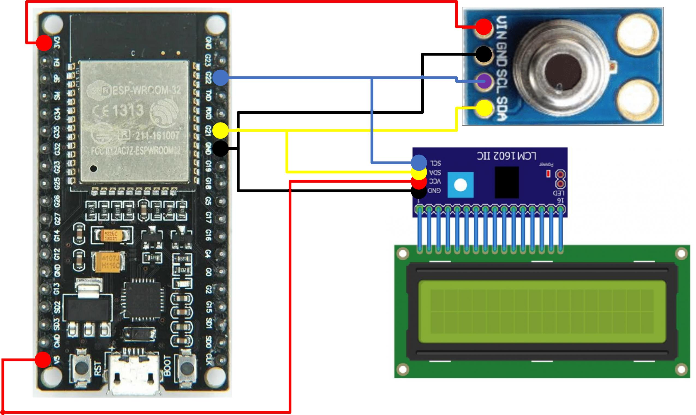

# ESP32 com MLX90614 e LCD16x2

Este projeto conecta um sensor de temperatura infravermelho MLX90614 e um display LCD 16x2 ao ESP32 utilizando comunicação I2C.

## Componentes Utilizados
- ESP32
- Sensor MLX90614
- Display LCD 16x2 com módulo I2C

## Conexões
- **ESP32 5V** ↔️ **VCC do LCD**
- **ESP32 3V3** ↔️ **VCC do MLX90614**
- **ESP32 GND** ↔️ **GND do MLX90614 e LCD**
- **ESP32 GPIO 21 (SDA)** ↔️ **SDA do MLX90614 e LCD**
- **ESP32 GPIO 22 (SCL)** ↔️ **SCL do MLX90614 e LCD**



## Código
```cpp
#include <Wire.h>
#include <Adafruit_MLX90614.h>
#include <LiquidCrystal_I2C.h>

Adafruit_MLX90614 mlx = Adafruit_MLX90614();
LiquidCrystal_I2C lcd(0x27, 16, 2);

void setup() {
  Wire.begin();
  mlx.begin();
  lcd.begin();
  lcd.backlight();
}

void loop() {
  float objectTemp = mlx.readObjectTempC();
  
  lcd.clear();
  lcd.setCursor(0, 0);
  lcd.print("Temp: ");
  lcd.print(objectTemp);
  lcd.print(" C");
  
  delay(1000);
}
